# Meeting Notes 4_28

## Map Updates

**From last week:**

- [x] Resolved the login issue

  Replaced substation layer, now can access without arcgis account

- [x] Resolved the perimeter measuring issue

- [x] Resolved the measuring unit issue

  now all measuring units are in feet

  area measurement now in acres

**Added along the way**

- [x] lng/lat coord
- [x] Search and fly-to box

## Doc Demo / Process Mock

Project Sample: https://planetdetroit.org/2025/01/michigan-department-natural-resources-solar-development/

### 1. Open tool and login (optional)

https://humblepasty.github.io/rstep-demo/dist/

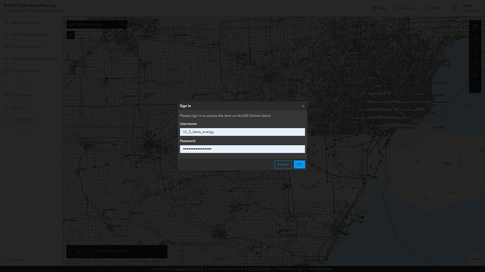

### 2. Search and go to research area

around "Gaylord Country Club"

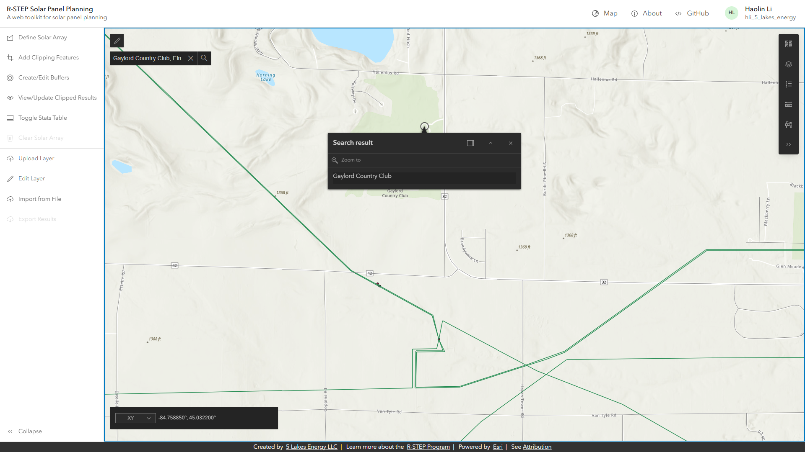

### 3. Switch basemap

switch basemap to "imagery Hybrid" to match original map

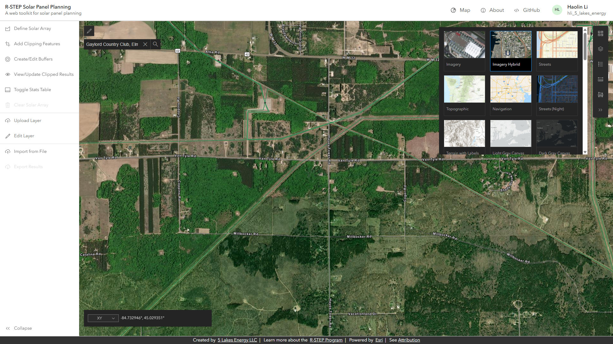

### 4. Define solar arrays

Use "Define Solar Array" -> Draw a polygon

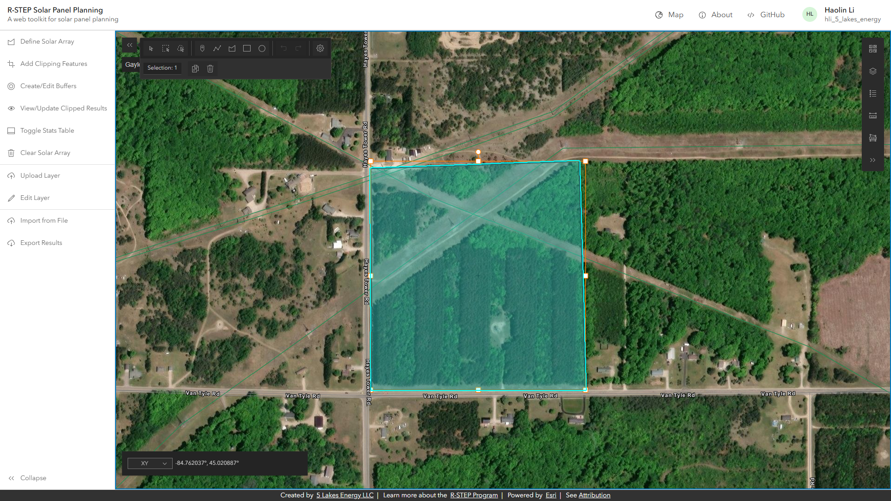

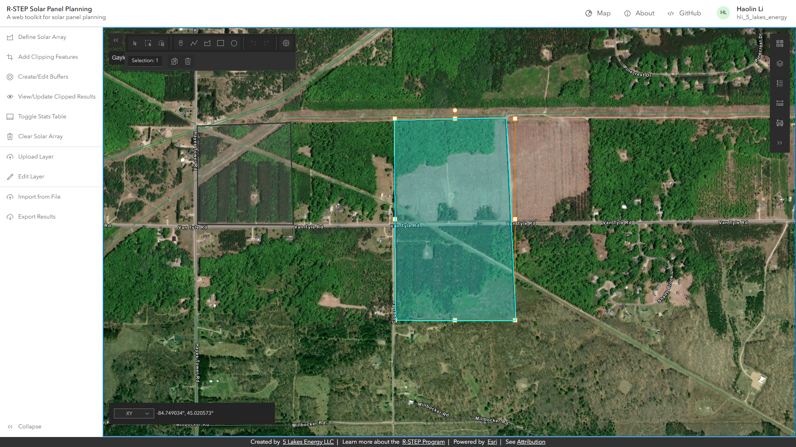

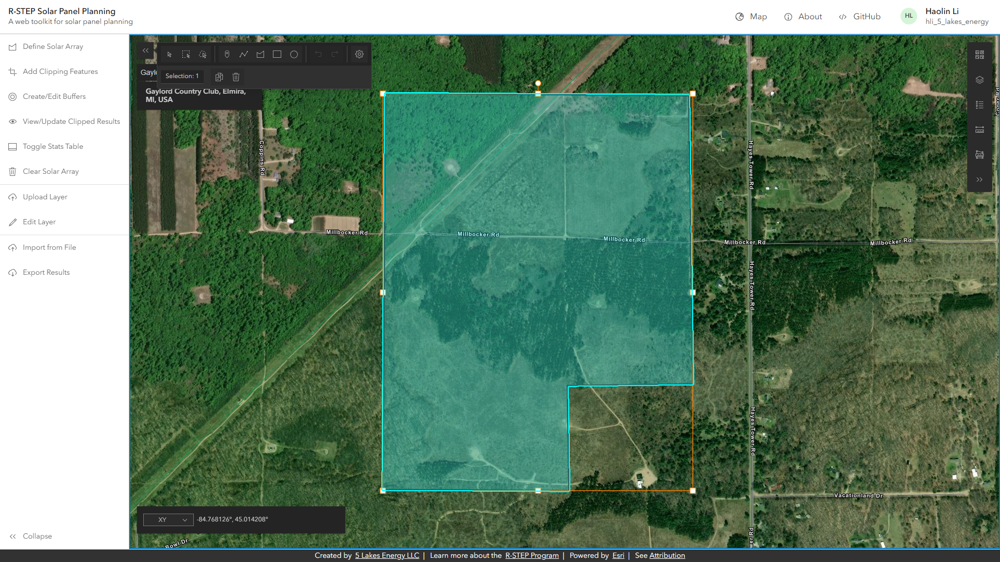

### 5. Show statistics

Toggle Stats Table

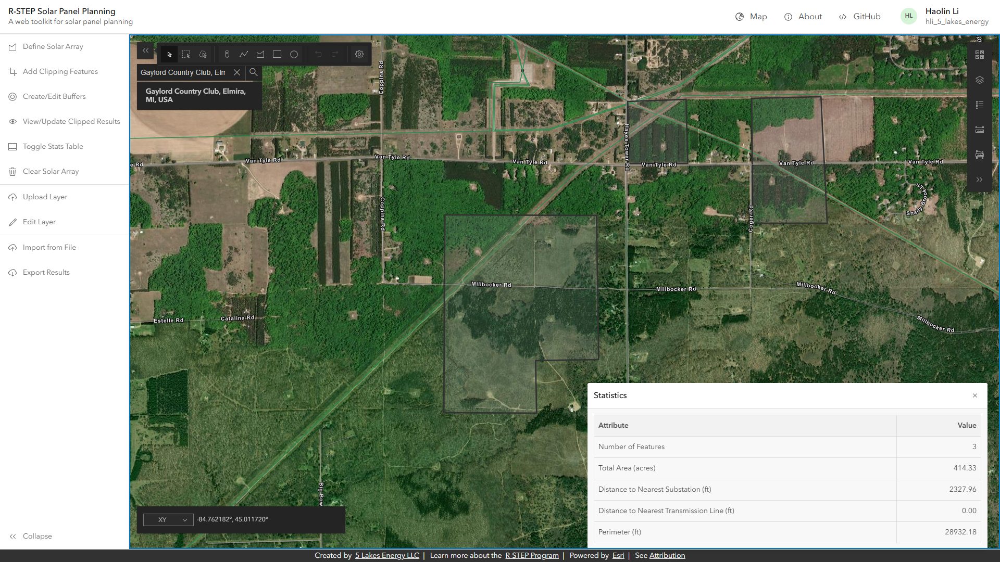

### 6. Add clipping features

Added by self-defined polyline

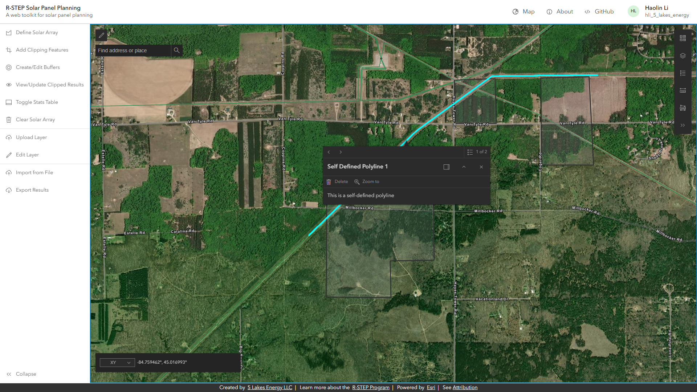

### 7. Define setback distance

set as 70 feet as example

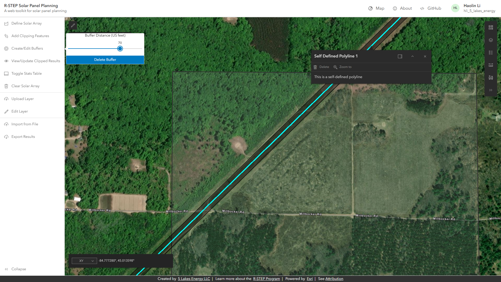

### 8. View results

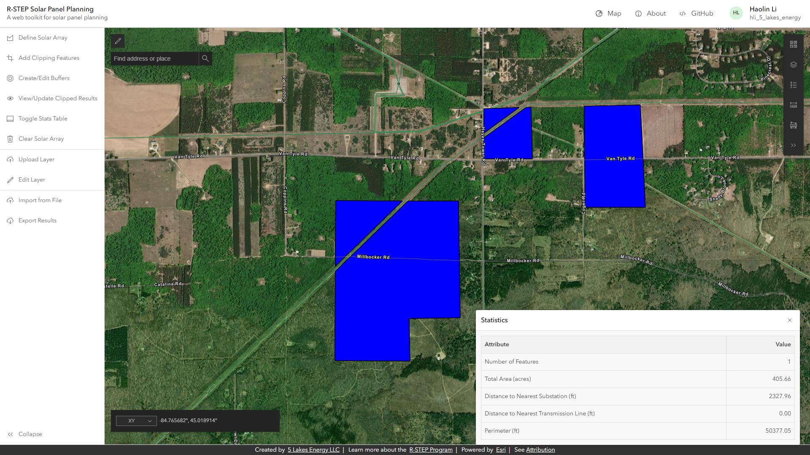

### 9. (Optional) Download results

The result will be saved as sketch.json

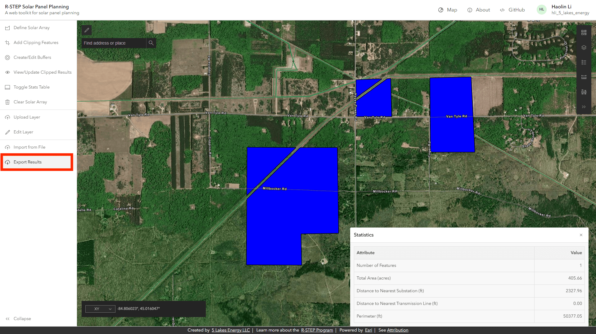

## Standing Issues for next week

- The symbology of the data layers are not visually compatible with satellite imagery basemap
- should show how many features are added to the clipping feature
- Currently the transmission line cannot be pickup or be selected and be added to clipping feature
- The number of feature is not correct
- Export statistics table option

