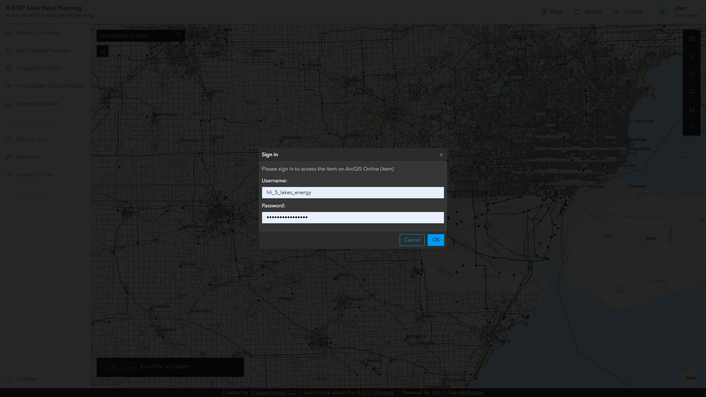
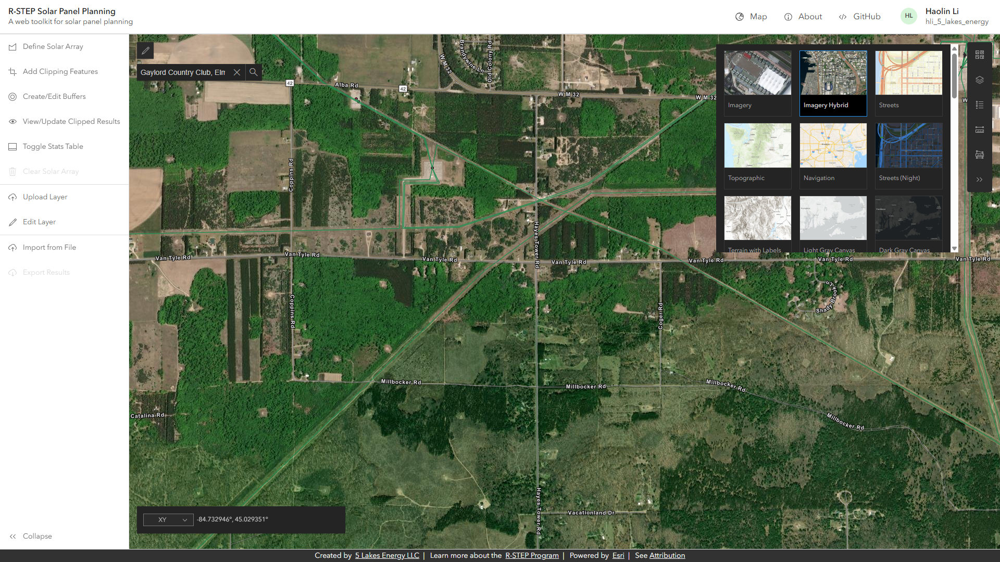
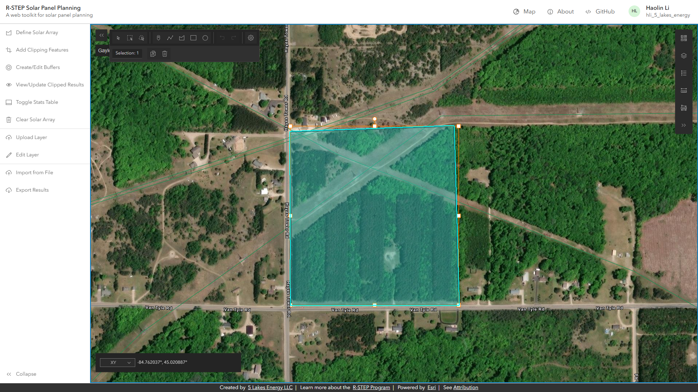
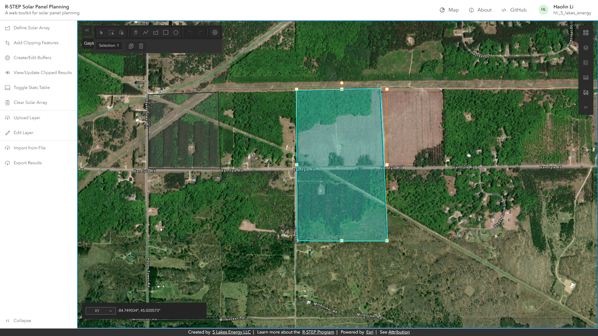
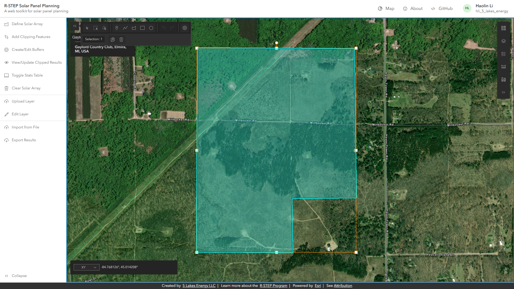
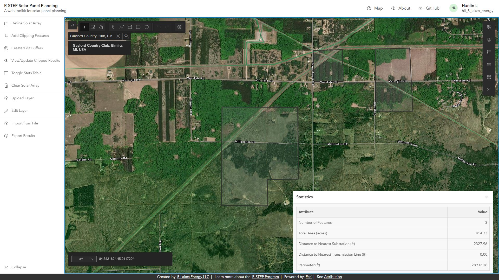
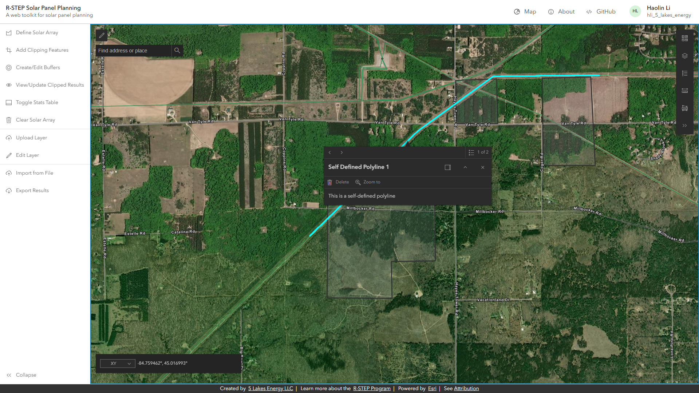
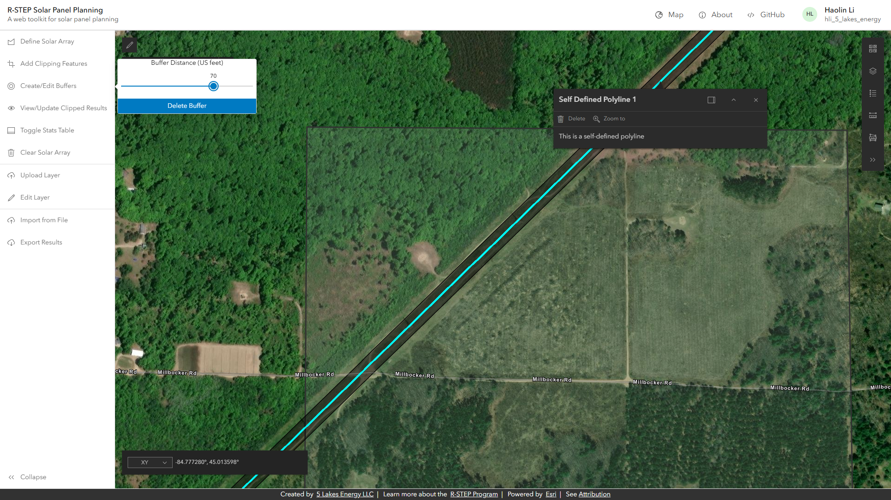
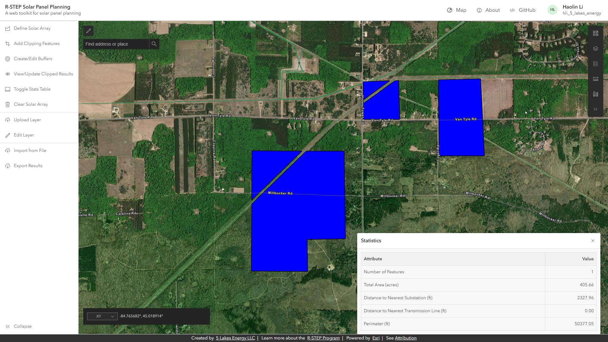
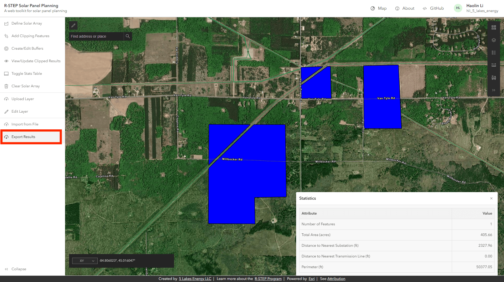

## Doc Demo / Process Mock

Project Sample: https://planetdetroit.org/2025/01/michigan-department-natural-resources-solar-development/

### 1. Open tool and login (optional)

https://humblepasty.github.io/rstep-demo/dist/

### 2. Search and go to research area

around "Gaylord Country Club"

### 3. Switch basemap

switch basemap to "imagery Hybrid" to match original map

### 4. Define solar arrays

Use "Define Solar Array" -> Draw a polygon

### 5. Show statistics

Toggle Stats Table

### 6. Add clipping features

Added by self-defined polyline

### 7. Define setback distance

set as 70 feet as example

### 8. View results

### 9. (Optional) Download results

The result will be saved as sketch.json

